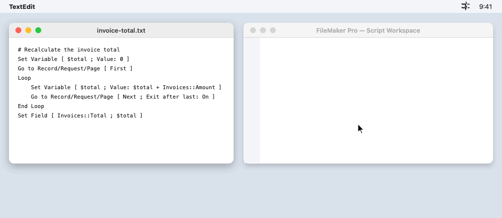
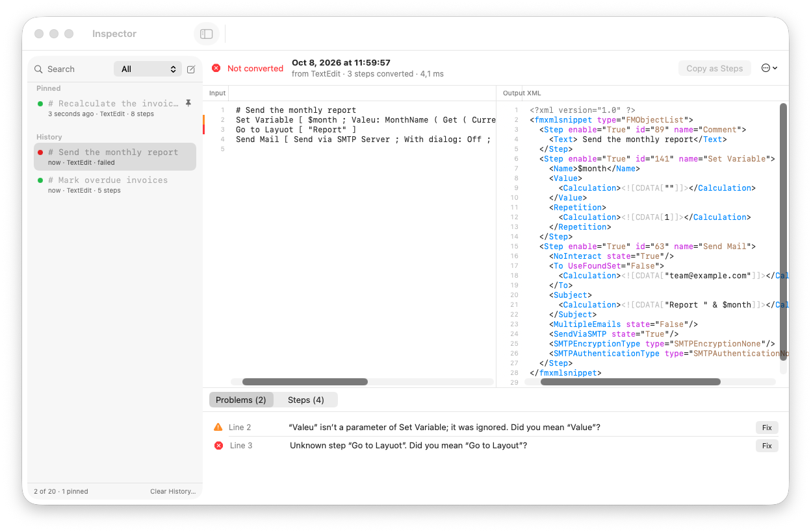
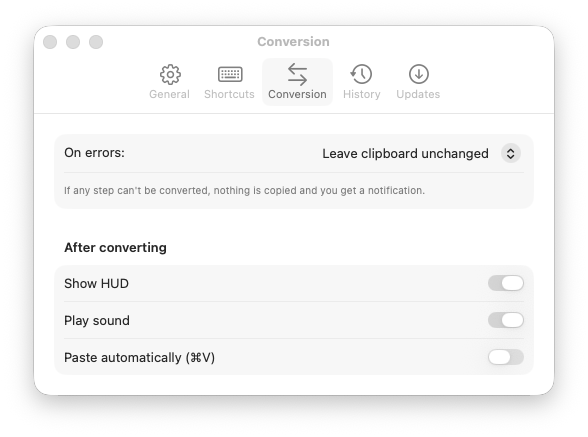
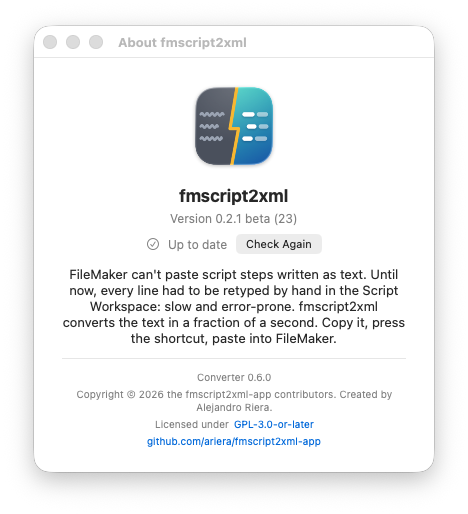

# fmscript2xml

FileMaker can't paste script steps written as text. A step you see in an
editor, a code review, documentation or an AI assistant has to be retyped by
hand in the Script Workspace, line by line. For experienced developers this
is slow, error-prone and frustrating work.

fmscript2xml removes that work. Copy the steps as text, press **⌃⌥⌘F**,
and paste them into FileMaker as real script steps. The conversion takes a
fraction of a second.



## Install

Requires macOS 14 (Sonoma) or later. FileMaker Pro doesn't need to be
installed for the conversion.

fmscript2xml is in **beta** for all 0.x versions.

1. Download the latest DMG from
   [Releases](https://github.com/ariera/fmscript2xml-app/releases).
2. Drag **fmscript2xml** to Applications and open it.
3. Beta builds aren't notarised by Apple yet, so macOS blocks the first
   launch. Click **Done**, open **System Settings → Privacy & Security**,
   click **Open Anyway** next to "fmscript2xml was blocked", and confirm.
   You only do this once. (Or run
   `xattr -dr com.apple.quarantine "/Applications/fmscript2xml.app"`.)
4. The welcome window shows the shortcut and offers to launch the app at login.
   Allow notifications: failures are reported that way.

The app lives in the menu bar. Updates are offered automatically (Sparkle).

## Use

1. Copy script steps as text, for example:

   ```
   Set Variable [ $count ; Value: Get ( FoundCount ) ]
   If [ $count = 0 ]
       Exit Script [ Text Result: "none" ]
   End If
   ```

2. Press **⌃⌥⌘F**. A short message confirms "4 steps ready to paste".
3. Paste into a script in FileMaker's Script Workspace.

If a step can't be converted, the clipboard is left unchanged and a
notification names the line, with a "did you mean" suggestion when there is
one. Click **Open Inspector** to fix it.

**History.** The menu bar lists the last conversions (failed ones included).
Click one to copy its steps again. The number kept is set in Settings
(default 20, 0 turns history off). Pin the ones you reuse (right-click in the
inspector → Pin): pinned entries stay at the top, never expire and don't count
toward the limit.

**Inspector.** Menu bar → Inspector, or a shortcut you can turn on in Settings
(⌃⌥⇧⌘F by default). It shows the history on the left, and for
each conversion the input next to the XML it produced. Hover or select input
lines to see the XML steps they became, and the reverse. The input is
editable and reconverts as you type. Problems have **Fix** buttons. The Steps
tab shows what the parser read for each step. **Copy as Steps** copies an
edited version and saves it as a new history entry. **New Draft** gives an
empty playground.



**Settings** has five tabs. *General*: launch at login, show in Dock, and the
installed FileMaker versions. *Shortcuts*: convert, and an optional shortcut to
open the inspector. *Conversion*: what to do on errors (leave the clipboard
unchanged, or copy what converted), HUD, sound, and pasting automatically
after converting. *History*: how many conversions to keep, and whether to keep
them after quitting. *Updates*: the version, and checking for updates.

<p>
  
  
</p>

## Troubleshooting

- **The shortcut does nothing.** Another app may use ⌃⌥⌘F. Choose another
  shortcut in Settings. If you used the old Automator Quick Action, turn its
  shortcut off in System Settings → Keyboard → Keyboard Shortcuts → Services.
- **"Already FileMaker steps".** The clipboard already holds FileMaker objects
  (for example, steps copied in FileMaker). Paste them directly.
- **"Clipboard has no text".** Copy the script text first.
- **Pasting gives text, not steps.** Paste into a script's step list in the
  Script Workspace, not into a calculation dialog.
- **The menu bar icon is missing.** On a crowded menu bar macOS hides some
  icons. Check System Settings → Menu Bar. You can also turn on "Show in
  Dock" in Settings.
- **No failure notifications.** Allow notifications for fmscript2xml in
  System Settings → Notifications.
- **Paste automatically does nothing.** It needs Accessibility permission:
  System Settings → Privacy & Security → Accessibility.
- **Steps that reference layouts, scripts or fields.** FileMaker resolves them
  by name when you paste. A comment with the original line is added above
  each one so you can check it.

History is stored on this Mac only, in
`~/Library/Application Support/fmscript2xml-app/history.json`. Scripts can
contain credentials; turn off "Keep history after quitting" to keep history
in memory only.

## Command line

The package includes a CLI with the same options as the original Python
`fmscript2xml` tool:

```sh
swift run fmscript2xml script.txt                 # writes script.txt.xml
swift run fmscript2xml script.txt --clipboard     # copies FileMaker steps
swift run fmscript2xml script.txt --print --diagnostics --explain
```

## Building

Requires macOS 14+, Xcode 16+ and [XcodeGen](https://github.com/yonaskolb/XcodeGen)
(`brew install xcodegen`).

```sh
swift test                      # converter tests (public fixtures)
tools/build-app.sh Debug --open # build and run the menu bar app
tools/release.sh 0.1 --dry-run  # release build and DMG, unsigned
```

See [CONTRIBUTING.md](CONTRIBUTING.md) for the project layout, tests and
rules, and [PLAN.md](PLAN.md) for the design.

## Licence

GPL-3.0-or-later. See [LICENSE](LICENSE).

Copyright © 2026 the fmscript2xml-app contributors. ~Created~ Needed and also prompted by Alejandro Riera.
